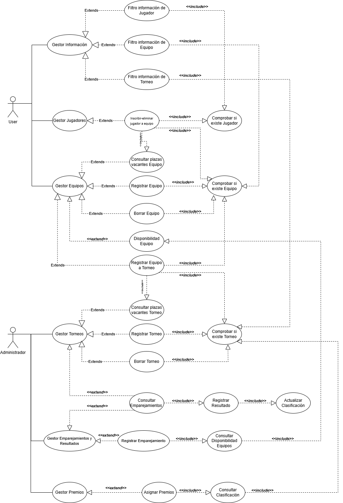
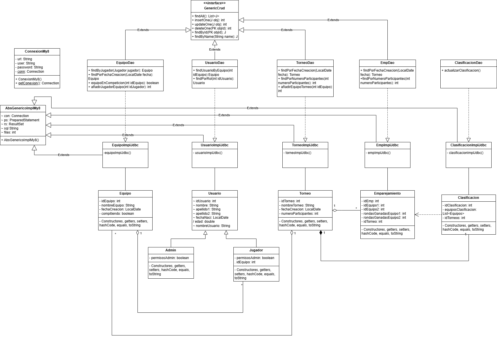

# Sistema de Gestión de Torneos de eSports 
 
## Autor 
Arturo Bermúdez Lozano

[Perfil de GitHub](https://github.com/arturobermvdez)
 
## Descripción del Proyecto 
 
[Link al repositorio del proyecto](https://github.com/arturobermvdez/torneo-esports-uml)
 
Este proyecto implementa un sistema de gestión de torneos de eSports 
utilizando UML para el modelado y Java para la implementación. 
 
## Diagramas UML 
### Diagrama de Casos de Uso 
 
 
### Diagrama de Clases 
 
 
## Justificación del diseño 
He decidido usar un diseño de patron DAO con la finalidad de separar la lógica del negocio de la manera de implementar la base de datos, lo que permite un mejor mantenimiento y escalabilidad del código de la aplicación. Además, si la base de datos cambia de tecnología, solo hay que adaptar el código que implementa ésta.

Por otro lado, al usar este patrón, permite una reusabilidad del código, ya que la parte DAO se puede utilizar en diferentes capas de nuestra app.
 
## Conclusiones  
Este trabajo me ha enseñado a valorar la fase de analisis y diseño de un sistema. Creo que, la capacidad de análisis es importante a su vez de la capacidad de volver atrás en caso de haber cometido un error, reanalizar el problema para encontrar una mejor solución.

También creo que es importante con tal de ser más productivo al desarrollar el sistema ya que seguimos un plan.